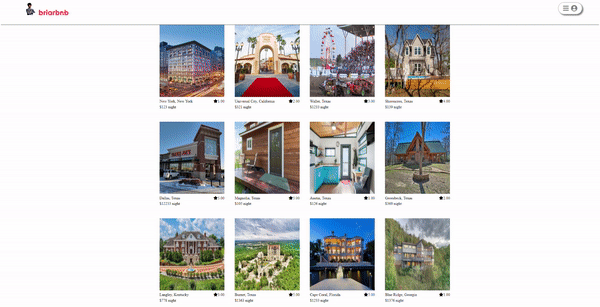
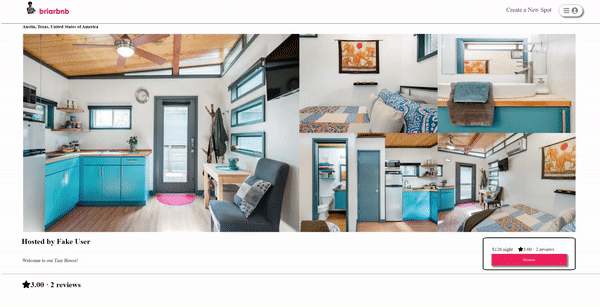

# Briarbnb

[Briarbnb](https://briarbnb.onrender.com) is a clone of Airbnb. Users can create their own spots that others can book and review. They can also add images of the spots. Users can book any spot as long as it doesn't belong to them and they don't book on a date another user has booked. With the reviews you can leave your feelings and ratings while also providing images for clarity.

## Index
[Database Schema](https://github.com/zipzopboppitybop/BriarBnB/wiki/Database-Schema) | [MVP Feature List](https://github.com/zipzopboppitybop/BriarBnB/wiki/Features)

## Technologies Used

## Splash Page

## Single Spot and Reviews

## Getting started
1. Clone this repository:

   `
  https://github.com/zipzopboppitybop/BriarBnB
   `
2. Install denpendencies into the backend and frontend repositories with the following:

   * `npm install`

3. Create a **.env** file using the **.envexample** provided

4. Set up your database with information from your .env and then run the following to create your database, migrate, and seed:

   * `npx dotenv sequelize db:create`
   * `npx dotenv sequelize db:migrate`
   * `npx dotenv sequelize db:seed:all`

5. Start the app for both backend and frontend using:

   * `npm start`

6. Now you can use the Demo User or Create an account

***

# Features

## Spots
* Users can create a Spot
* Users can read/view other Spot
* Users can update their Spot
* Users can delete their Spot

## Reviews
* Users can create Reviews on Spots
* users can read/view all of the Reviews on a Spot
* Users can delete their Review(s) on a Spot

## Bookings
Logged-in Users can
* Create a booking at a spot
* Update their booking at a spot
* Read all of their bookings
* Delete/Cancel their booking

## Future Features

### Google Maps Api
* Locate their spot with Google Maps Api

## My Links

([GitHub](https://github.com/zipzopboppitybop) | [LinkedIn](https://www.linkedin.com/in/brian-washington-668129244/))
